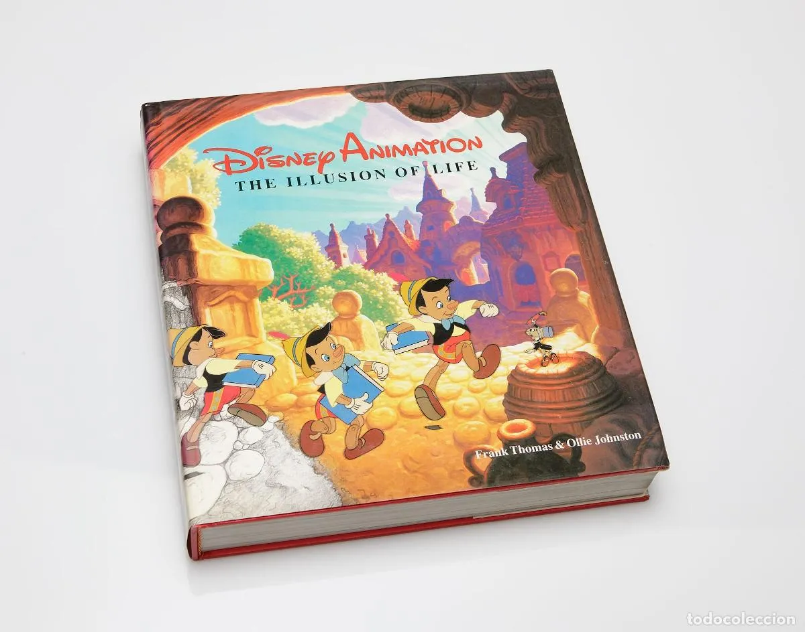
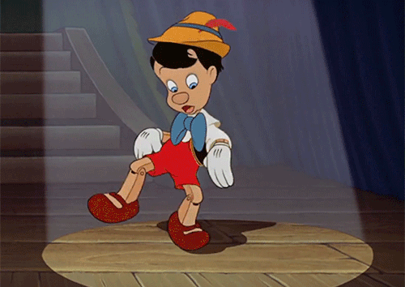
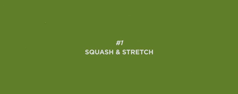
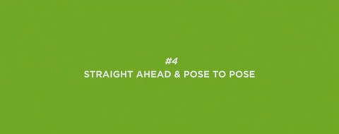
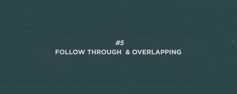
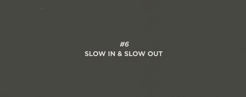
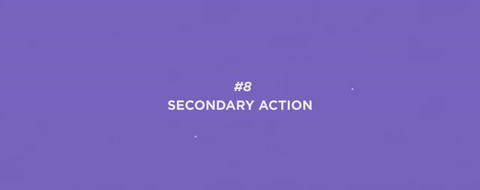
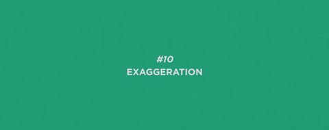
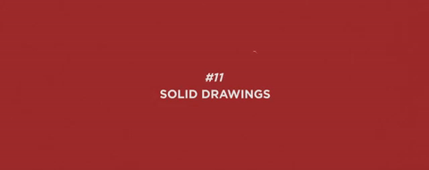
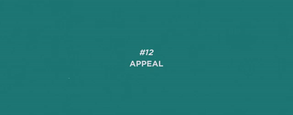

## 🎁 Primera parte: Introducción a la animación web

### **💃 ¿Qué es una animación?**
Una animación es una modificación de la forma o de la posición de un elemento de HTML en un intervalo de tiempo determinado.

Las animaciones se utilizan a menudo en la web para mejorar la experiencia del usuario y para hacer que nuestros productos sean más atractivos y fáciles de utilizar. También se emplean en la industria del entretenimiento, como en películas y dibujos animados.

Por ejemplo, las animaciones de CSS se inspiran en las animaciones de dibujos animados de Disney y en sus principios de animación.

### **🤔 ¿Por qué utilizar animaciones?**
Las animaciones pueden ser utilizadas para mejorar la experiencia del usuario y para hacer que nuestros productos sean más atractivos y fáciles de utilizar.

Las animaciones pueden ser utilizadas para:

- **Mejora la experiencia del usuario (UX)** Atrae la atención hacia elementos importantes.
- **Guiar la atención del usuario** hacia un elemento o una acción específica.
- **Mostrar relaciones y transiciones** entre elementos.
- **Proporcionar retroalimentación visual** a los usuarios.
- **Agregar interactividad y diversión** a la experiencia de usuario.

### **🍋 Conceptos básicos y terminología**
- **Animación:** Secuencia de imágenes o elementos que crean la ilusión de movimiento.
- **Fotograma (frame):** Imagen individual dentro de una secuencia de animación.
- **Tiempo de animación:** Duración total de la animación (generalmente en segundos o milisegundos).
- **Retardo (delay):** Tiempo antes de que comience la animación.
- **Iteraciones (iterations):** Número de veces que se repite la animación.

### **🤓 ¿Cómo funcionan las animaciones en la web?**
Las animaciones en la web funcionan a través de fotogramas (frames) y fotogramas clave (keyframes).

- Un **fotograma** es un cuadro de una animación. Los fotogramas clave son fotogramas que definen el inicio y el final de una animación.
- Un **fotograma clave** es un fotograma que define el inicio y el final de una animación.

El navegador ya se encarga de calcular los fotogramas intermedios entre los fotogramas clave. Por ejemplo, si definimos un fotograma clave al inicio de una animación y otro al final, el navegador calculará los fotogramas intermedios para crear una animación fluida. Esto se conoce como **interpolación**.

### **🤩 ¿Cómo se crean las animaciones en la web?**
Las animaciones en la web se crean utilizando CSS y JavaScript. En CSS, las animaciones se crean utilizando las propiedades `transition` y `animation`. En JavaScript, las animaciones se crean utilizando la API Web Animation. En esta sesión nos centraremos en las animaciones de CSS. Aunque comentaremos librerías de JavaScript que nos pueden ayudar a crear animaciones más complejas. Como por ejemplo [GSAP](https://greensock.com/gsap/).


### **🥳 Los 12 principios de la animación**
Los llamados **«doce principios básicos de la animación»** fueron presentados en 1981 por los animadores Ollie Johnston y Frank Thomas de Walt Disney Animation Studio en su libro The Illusion of Life: Disney Animation basándose en el trabajo de los animadores de Disney desde 1930 en adelante.

<p align="center">
  
</p>

Muchos animadores llaman a este libro la «biblia de la animación» y en 1999 fue votado como el mejor de los libros de animación de todos los tiempos.

El objetivo de documentar estos principios fue crear guías para producir animaciones más realistas y que las animaciones se apegaran un poco más a las leyes básicas de la física, aunque también se tratan temas más abstractos, como la sincronización emocional y el atractivo de un personaje.



Aunque los 12 principios originalmente fueron desarrollados para usarse en animación tradicional, estos también pueden utilizarse como guías en diseño interactivo para la creación de transiciones y microinteracciones en productos digitales:

### 🙆🏻‍♀️ 1. Estirar y encoger
El principio de estirar y encoger agrega a una animación la idea de peso y flexibilidad. Puede ser aplicado a objetos simples, como un círculo rebotando o algo más complejo como tarjeta o una pantalla completa.​ Lo más importante de este principio es que el volumen del objeto no cambia cuando se estira o se encoge.



### 🏃‍♀️ 2. Anticipación 
La anticipación se usa para preparar al observador para una acción y que la animación se sienta más realista. Esta técnica también se utiliza en momentos en que va a ocurrir un evento importante para preparar al observador y que éste preste atención a lo que está a punto de suceder.


### 🎭 3. Puesta en escena 
Este principio está basado en lo que en teatro y en cine se conoce como «puesta en escena«. El propósito es dirigir la atención del observador y definir qué es lo más importante en su campo de visión.​ Esto puede hacerse de diferentes maneras, como colocar lo que queremos que el usuario centre su atención dentro del cuadro, usando luces y sombra, o la perspectiva del punto de visión del observador.​

Lo importante es mantener la atención del observador en lo que es relevante, evitando los detalles innecesarios. En diseño interactivo, la definición de affordances es parte de la puesta en escena.


### 🪅 4. Animación directa y pose a pose 
Estas son dos aproximaciones distintas al proceso de crear una animación: la animación directa significa dibujar directamente una escena cuadro por cuadro de principio a fin. La animación directa crea una ilusión de fluidez y dinamismo en el movimiento y es mejor para producir secuencias realistas, aunque en esta técnica es más difícil mantener proporciones y perspectivas precisas.

La animación pose a pose implica empezar el proceso de animación dibujando los cuadros clave y posteriormente llenando los espacios (algo que los diseñadores familiarizados con Adobe Flash conocen como tweetning). ​Por lo general, se usa una combinación de ambas técnicas para mejores resultados.



### 🎬 5. Acciones complementarias y superpuestas 
Las acciones complementarias y las superpuestas son técnicas de animación que se relacionan estrechamente, ya que ambas ayudan a que el movimiento sea más realista y dé la ilusión de que un objeto se mueve respetando el principio físico de la inercia:

La acción complementaria significa que las piezas desvinculadas del objeto deben continuar su movimiento incluso después de que el objeto dejó de moverse, y deben mostrar el movimiento de amortiguación.
La acción superpuesta se aplica cuando las partes de un objeto se mueven en diferentes rangos o momentos según su relación con el objeto principal y a la velocidad en que éste se mueva.



### 👀 6. Acelerar y desacelerar 
En el mundo real ningún objeto pasa del reposo absoluto al movimiento continuo en un paso: todos los objetos necesitan tiempo para acelerar o disminuir su velocidad. En animación, los objetos se mueven más despacio al principio y más lentamente al final de una acción, para crea un efecto de arranque y frenado que haga la animación más realista.



### 🌉 7. Arcos 
Casi nada en el mundo real se mueve en línea recta, y tampoco en la animación. La de los objetos, incluyendo seres vivos y personas se mueven en caminos circulares llamados arcos.

Los arcos operan a lo largo de una trayectoria curva que agrega la ilusión de vida a un objeto animado en acción. Sin arcos, las animaciones se sienten rígidas y mecánicas.


### 🥈 8. Acción secundaria 
Agregar movimientos adicionales a la acción principal le agrega más vida y la enfatiza en lugar de desviar la atención de ellas. Las acciones secundarias funcionan mejor si se agregan al principio y al final del movimiento principal.



### ⏰ 9. Sincronización 
La sincronización en animación se refiere a los momentos (o tiempos) en que ocurre algo en ella. El éxito de una animación depende de cómo se represente el paso del tiempo, ya que una buena sincronización le agrega ritmo y emoción.

En ocasiones es bueno agregar un sonido incidental temprano, ya que el oído está más en sintonía con las sutilezas de la sincronización que el ojo.


### 🤣 10. Exageración 
En animación, a veces más es mejor. La exageración presenta las características y acciones de un objeto de una manera extrema para obtener un efecto cómico o dramático. Esto puede incluir distorsiones en la forma del objeto o en su movimiento.

La exageración es una excelente recurso para aumentar el atractivo emocional de la animación y mejorar su narrativa.



### 🎨 11. Dibujo sólido 
El principio de dibujo sólido significa representar formas de manera tridimensional dando la ilusión de volumen y peso en una pantalla plana.

Para lograrlo es necesario comprender y aplicar correctamente conceptos básicos de perspectiva, volumen, peso, equilibrio, iluminación, etc. en referencia de la experiencia del observador en el mundo real.



### 💃 12. Atractivo 
Las personas recuerdan a los personajes que sienten reales, interesantes y atractivos. Los objetos y personajes animados deben ser agradables a la vista y tener un aspecto placentero. El atractivo en un objeto animado es lo que en los actores humanos se llama carisma.

El atractivo en la animación puede ser difícil de cuantificar porque cada persona tiene una idea y expectativas diferentes sobre lo que consideran atractivo, y esta percepción también cambia entre culturas y con el paso del tiempo.



### **🤷‍♀️ ¿Qué tipos de animaciones existen?**
Existen tres tipos de animaciones en la web:

- **Animaciones:** Secuencia de fotogramas que crean un efecto visual.
- **Transiciones:** Cambios graduales entre dos estados de un elemento.
- **Transformaciones:** Cambios en la forma, tamaño o posición de un elemento.
- **Interacciones y microinteracciones:** Animaciones desencadenadas por acciones del usuario.


### **🍿 Formas de CSS para animar en la web**
Existen varias formas de animar elementos en la web:

- **Utilizando la propiedad animation de CSS** nos permite especificar una serie de estilos que se aplican a un elemento en un intervalo de tiempo determinado.

- **Utilizando la propiedad transition de CSS** que nos permite especificar un cambio suave de un estado inicial uno final modificando los estilos, por ejemplo, al pasar el ratón por encima de un botón.

- **Utilizando la propiedad transform de CSS:** esta propiedad permite modificar la forma, tamaño o posición de un elemento de HTML utilizando transformaciones como rotación, escalado o traslación.

A pesar de que pueden ser confundidas entres sí, son tres especificaciones diferente de CSS, y todas ellas se pueden utilizar para crear animaciones en la web. Vamos a comparar y ver las diferencias entre ellas.

### **🤺 Animaciones CSS vs Transiciones CSS vs Transformaciones CSS**
1. Las **animaciones CSS** son secuencias de cambios de estilos que se aplican a un elemento en un intervalo de tiempo determinado. 
Puedes controlar el tiempo que tarda cada animación en ejecutarse, así como la cantidad de veces que se repite. Las animaciones se pueden crear utilizando la propiedad animation, y se pueden aplicar a cualquier elemento de HTML.

2. Las **transiciones CSS** son cambios suaves de un estilo a otro. Por ejemplo, si cambias el tamaño de un elemento de forma gradual en lugar de de manera instantánea, estarías utilizando una transición. 
Las transiciones se pueden crear utilizando la propiedad transition, y también se pueden aplicar a cualquier elemento de HTML.

3. Las **transformaciones CSS** son cambios que se aplican a elementos de HTML para modificar su forma, tamaño o posición. 
Por ejemplo, puedes utilizar una transformación para rotar un elemento, hacerlo más grande o más pequeño, o moverlo a una nueva posición en la pantalla. Las transformaciones se pueden crear utilizando la propiedad transform, y también se pueden aplicar a cualquier elemento de HTML.

**En resumen**, las **animaciones** son secuencias de cambios de estilos que se aplican en un intervalo de tiempo determinado, las **transiciones** son cambios suaves de un estilo a otro, y las **transformaciones** son cambios que se aplican a elementos de HTML para modificar su forma, tamaño o posición.

## 🎥 Segunta parte: Animando con transiciones

### **🎳 Transiciones CSS**
Las **transiciones CSS**, por otro lado, son una forma más sencilla de crear animaciones que cambian gradualmente de un estado a otro. 

- La **interpolación** es el proceso de calcular los valores intermedios entre dos valores dados. Por ejemplo, podemos calcular el valor intermedio entre 0 y 100, que es 50.

- La interpolación es un concepto clave en la animación, y se refiere al proceso de calcular valores intermedios entre dos puntos. En la animación web, la interpolación se utiliza a menudo para suavizar los cambios de estilo entre dos fotogramas clave.

Por ejemplo, si quieres animar el cambio de tamaño de un elemento de HTML de 100px a 200px en un intervalo de tiempo de 1 segundo, podrías utilizar la interpolación para calcular el tamaño del elemento en cada fotograma intermedio. De esta manera, en lugar de cambiar el tamaño del elemento de manera instantánea, se produciría una transición suave entre los dos tamaños.

1. Todo lo que tenemos que especificar para crear una animación es el valor inicial y el valor final. El navegador se encargará de calcular los valores intermedios.

2. Por ejemplo, podemos usar transiciones para cambiar el color de un elemento cuando el usuario pasa el mouse por encima, o para hacer que un elemento se desplace suavemente de un
lugar a otro. 

3. Las transiciones CSS son útiles para crear efectos simples y sutiles, pero no son tan potentes como las animaciones CSS.

Para crear una transición CSS, necesitamos utilizar las siguientes propiedades:

- **transition-property:** esta propiedad especifica qué propiedades CSS deben tener una transición. Por ejemplo, si quieres crear una transición en el color de fondo de un elemento, deberías especificar background-color como la propiedad de transición.

- **transition-duration:** esta propiedad determina la duración de la transición.

- **transition-timing-function:** esta propiedad permite controlar la velocidad de la transición en diferentes puntos del tiempo.

- **transition-delay:** esta propiedad permite retrasar el inicio de la transición.

Aquí tienes un ejemplo de cómo se podría utilizar una transición CSS para hacer que un elemento cambie de color al pasar el ratón por encima:

```css
.transitioning {
  transition-property: background-color;
  transition-duration: 1s;
}

.transitioning:hover {
  background-color: red;
}
```

En este caso, hemos creado una transición en la propiedad background-color que dura 1 segundo. Cuando el usuario pasa el ratón por encima del elemento, la propiedad background-color cambia a rojo de forma gradual en lugar de de forma instantánea.


Las transiciones son muy útiles crear una animación entre dos estados, pero si queremos poder animar más de 2 estados, tenemos que utilizar los @keyframes.


## 🎥 Tercera parte: Animando con CSS

### **🎞️ Animaciones CSS: @keyframes**

- **@keyframes:** esta regla permite definir las fases de la animación, especificando cómo debe cambiar el estilo de un elemento en diferentes puntos del tiempo.

Las keyframes son puntos clave dentro de la animación que determinan cómo cambiará el elemento en cada punto de tiempo.

Para crear una animación con keyframes, primero debes definir las keyframes utilizando la regla @keyframes. Esto se hace de la siguiente manera:

@keyframes nombreDeLaAnimacion {
  /* estilos para los diferentes puntos de tiempo */
}
Dentro de las llaves de la regla @keyframes, puedes definir diferentes puntos de tiempo utilizando porcentajes o palabras clave como "from" y "to". Por ejemplo:

```css
@keyframes nombreDeLaAnimacion {
  0% {
    /* estilos para el inicio de la animación */
  }
  100% {
    /* estilos para el final de la animación */
  }
}
```

También puedes definir múltiples puntos de tiempo con porcentajes intermedios:

```css
@keyframes nombreDeLaAnimacion {
  0% {
    /* estilos para el inicio de la animación */
  }
  50% {
    /* estilos para la mitad de la animación */
  }
  100% {
    /* estilos para el final de la animación */
  }
}
```

Una vez que hayas definido tus keyframes, puedes aplicar la animación a un elemento utilizando la propiedad "animation" en el estilo del elemento:

```css
.miElemento {
  animation: nombreDeLaAnimacion duracion tipoDeRepeticion tiempoDeRetraso;
}

/* Por ejemplo: */
.miElemento {
  animation: nombreDeLaAnimacion 5s linear 1s;
}
```

Esto crearía una animación que dura 5 segundos, se reproduce de manera linear (sin aceleración ni desaceleración) y se retrasa 1 segundo antes de comenzar.

### **🦄 Animaciones CSS: propiedades**
Veamos en más detalle cómo crear una animación CSS. Para ello, vamos a utilizar las siguientes propiedades:

- **animation-name:** esta propiedad se utiliza para vincular la animación a un elemento.

- **animation-duration:** esta propiedad determina la duración de la animación.

- **animation-timing-function:** esta propiedad permite controlar la velocidad de la animación en diferentes puntos del tiempo.

- **animation-delay:** esta propiedad permite retrasar el inicio de la animación.

- **animation-iteration-count:** esta propiedad determina cuántas veces se repetirá la animación.

- **animation-direction:** esta propiedad permite controlar si la animación se reproducirá de forma normal o al revés.

- **animation-fill-mode:** esta propiedad permite controlar el estilo de un elemento una vez finalizada la animación.

Para **crear una animación en CSS**, debemos seguir estos pasos:

**Definir las fases de la animación utilizando la regla @keyframes**. Esta regla permite especificar cómo debe cambiar el estilo de un elemento en diferentes puntos del tiempo. Por ejemplo, si quieres hacer que un elemento parpadee, podrías definir dos fases: una en la que la opacidad del elemento sea 1 y otra en la que sea 0.

1.**Asignar un nombre a la animación utilizando la propiedad animation-name.** Esto te permitirá vincular la animación a un elemento más tarde.

2.**Especificar la duración** de la animación utilizando la propiedad animation-duration.

Opcionalmente, podemos utilizar otras propiedades como animation-timing-function, animation-delay, animation-iteration-count y animation-direction para controlar aspectos como la velocidad de la animación, el retraso en el inicio, el número de veces que se debe repetir y la dirección de reproducción.

Aplicamos la animación a un elemento utilizando la propiedad animation-name. Puedes hacerlo directamente en el estilo de un elemento o utilizando una clase y asignándola al elemento.

**Aquí vemos un ejemplo** de cómo se podría crear una animación sencilla para hacer que un elemento parpadee:

```css
@keyframes blink {
  50% {
    opacity: 0;
  }
}

.blinking {
  animation-name: blink;
  animation-duration: 1s;
  animation-iteration-count: infinite;
}
```

En este caso, hemos creado una animación llamada blink que alterna la opacidad del elemento entre 0 y 1 cada segundo, de forma repetida. Luego, podemos aplicar esta animación a un elemento asignando la clase blinking al elemento.

### **🕰️ Animaciones CSS: duración**

Las funciones de tiempo en CSS **se utilizan para especificar el tiempo que debe transcurrir antes de que una animación o transición se complete**. Por ejemplo, puedes utilizar una función de tiempo para especificar cuánto tiempo debe transcurrir antes de que un elemento cambie de un color a otro durante una transición.

Existen varias funciones de tiempo que puedes utilizar en CSS:

- **transition-duration:** Establece la duración de una transición.
- **transition-delay:** Establece el retraso antes de que se inicie una transición.
- **animation-duration:** Establece la duración de una animación.
- **animation-delay:** Establece el retraso antes de que se inicie una animación.

Aquí tienes un ejemplo de cómo utilizar estas funciones de tiempo en un estilo CSS:

```css
.mi-elemento {
  /* Establecemos una transición de 1 segundo */
  transition-duration: 1s;
  /* Establecemos un retraso de 0,5 segundos antes de que se inicie la transición */
  transition-delay: 0.5s;
  /* Establecemos una animación de 2 segundos */
  animation-duration: 2s;
  /* Establecemos un retraso de 1 segundo antes de que se inicie la animación */
  animation-delay: 1s;
}
```

### **🕰️ Animaciones CSS: timing functions**

Para empezar, vamos a establecer el contexto y asegurarnos de que todos estemos familiarizados con los escenarios en los que la función de tiempo es relevante.

La funcionalidad se vuelve disponible cuando se trabaja en el ámbito de la animación CSS, que incluye transiciones CSS así como animaciones basadas en fotogramas clave. Entonces, ¿qué es exactamente y qué hace?

Aunque puede parecer un poco confusa al principio, su objetivo es permitirte controlar la aceleración de las animaciones a lo largo de su duración. 

Es decir, puedes definir dónde la animación se acelera y desacelera durante su transcurso, lo que puede afectar la percepción del usuario sobre la rapidez o lentitud de la animación. Aunque no afecta la duración real de la animación, esta propiedad puede tener un gran impacto en la experiencia del usuario. 

Nota: No existe una propiedad real llamada "timing-function". Cuando me refiero a esta "propiedad", en realidad me estoy refiriendo tanto a las propiedades transition-timing-function como animation-timing-function.


> Nota: No existe una propiedad real llamada "timing-function". Cuando me refiero a esta "propiedad", en realidad me estoy refiriendo tanto a las propiedades transition-timing-function como animation-timing-function.

- **ease:** la animación comienza lentamente, acelera en el medio y termina lentamente.
- **linear:** la animación se reproduce de manera uniforme.
- **ease-in:** la animación comienza lentamente y acelera hacia el final.
- **ease-out:** la animación comienza rápidamente y se desacelera hacia el final.
- **ease-in-out:** la animación comienza lentamente, acelera en el medio y se desacelera hacia el final.
- **step-start:** la animación comienza de inmediato y luego se detiene en cada punto clave.
- **step-end:** la animación comienza de inmediato y luego se detiene en cada punto clave.
- **steps(n, start|end):** la animación comienza de inmediato y luego se detiene en cada punto clave. El primer parámetro especifica el número de pasos y el segundo parámetro especifica si la animación debe comenzar o terminar en cada punto clave.
- **cubic-bezier(n,n,n,n):** la animación se reproduce de acuerdo con una curva de Bézier personalizada. Los cuatro parámetros especifican los puntos de control de la curva.

Que es cubic-bezier? [Cubic-bezier](https://cubic-bezier.com/#.17,.67,.83,.67) es una función de tiempo que te permite crear una curva de Bézier personalizada. Una curva de Bézier es una curva matemática que se utiliza para crear transiciones suaves entre dos puntos. Puedes utilizar cubic-bezier para crear animaciones personalizadas.

Ejemplo con código CSS de una animación con diferentes funciones de tiempo:

```css
    animation-timing-function: ease;
    animation-timing-function: linear;
    animation-timing-function: ease-in;
    animation-timing-function: ease-out;
    animation-timing-function: ease-in-out;
    animation-timing-function: step-start;
    animation-timing-function: step-end;
    animation-timing-function: steps(4, end);
    animation-timing-function: cubic-bezier(0.1, 0.7, 1.0, 0.1);
```

### **🕰️ Animaciones CSS: delay**
La propiedad animation-delay permite especificar cuánto tiempo debe transcurrir antes de que comience una animación. Por ejemplo, si estableces animation-delay: 1s;, la animación comenzará 1 segundo después de que se aplique la animación.

Aquí tienes un ejemplo de cómo utilizar la propiedad animation-delay en un estilo CSS:

```css
.mi-elemento {
  animation-delay: 1s;
}
```

### **🕰️ Animaciones CSS: iteration count**
La propiedad animation-iteration-count permite especificar cuántas veces debe repetirse una animación. Por ejemplo, si estableces animation-iteration-count: 3;, la animación se reproducirá 3 veces.

Aquí tienes un ejemplo de cómo utilizar la propiedad animation-iteration-count en un estilo CSS:

```css
.mi-elemento {
  animation-iteration-count: 3;
}
```

### **🕰️ Animaciones CSS: direction**
La propiedad animation-direction permite especificar la dirección en la que debe reproducirse una animación. Por ejemplo, si estableces animation-direction: alternate;, la animación se reproducirá hacia adelante y hacia atrás.

Aquí tienes un ejemplo de cómo utilizar la propiedad animation-direction en un estilo CSS:

```css
.mi-elemento {
  animation-direction: alternate;
}
```

### **🕰️ Animaciones CSS: fill mode**
La propiedad animation-fill-mode permite especificar cómo se deben aplicar los estilos a un elemento antes y después de que se reproduzca una animación. Por ejemplo, si estableces animation-fill-mode: forwards;, el elemento conservará los estilos que tenía al final de la animación.

Aquí tienes un ejemplo de cómo utilizar la propiedad animation-fill-mode en un estilo CSS:

```css
.mi-elemento {
  animation-fill-mode: forwards;
}
```

### **🕰️ Animaciones CSS: shorthand**
La propiedad animation es una propiedad abreviada que te permite establecer todas las propiedades de animación en una sola declaración. Por ejemplo, puedes utilizar la propiedad animation para establecer la duración, el retraso, la función de tiempo, la dirección y el número de repeticiones de una animación.

Aquí tienes un ejemplo de cómo utilizar la propiedad animation en un estilo CSS:

```css
.mi-elemento {
  animation: 1s ease-in-out 2s infinite alternate;
}
```

## 😎 Cuarta parte: Responsive y Performance

## 3. Animación Responsive y Accesibilidad

El diseño responsive y adaptativo se refiere a la capacidad de un sitio web para ajustarse a diferentes dispositivos y tamaños de pantalla, proporcionando una experiencia óptima para el usuario en cada caso.

### 3.3. Consideraciones de accesibilidad en animaciones web

- No utilizar animaciones que puedan causar problemas de salud, como destellos rápidos o parpadeos.
- Proveer opciones para detener, pausar o reducir la velocidad de las animaciones.
- Asegurar que las animaciones no interfieran con la capacidad de un usuario para interactuar con el contenido.

### 3.4. Ejemplos y ejercicios prácticos

**Práctica:** Adaptar una animación para dispositivos móviles y tabletas utilizando media queries.

## 4. Herramientas y Librerías de Animación Web

### 4.1. GreenSock Animation Platform (GSAP)

```html
<!-- HTML -->
<script src="https://cdnjs.cloudflare.com/ajax/libs/gsap/3.9.1/gsap.min.js"></script>
<div id="example-gsap"></div>

<!-- CSS -->
<style>
#example-gsap {
  width: 100px;
  height: 100px;
  background-color: yellow;
}
</style>

<!-- JavaScript -->
<script>
gsap.to('#example-gsap', {
  duration: 1,
  x: 200,
  y: 200,
  scale: 2,
  rotation: 360,
  ease: 'bounce.out',
});
</script>
```

### 4.2. Anime.js

```html
<!-- HTML -->
<script src="https://cdnjs.cloudflare.com/ajax/libs/animejs/3.2.1/anime.min.js"></script>
<div id="example-anime"></div>

<!-- CSS -->
<style>
#example-anime {
  width: 100px;
  height: 100px;
  background-color: pink;
}
</style>

<!-- JavaScript -->
<script>
anime({
  targets: '#example-anime',
  translateX: 250,
  translateY: 250,
  scale: 2,
  rotate: '1turn',
  duration: 2000,
  easing: 'easeInOutQuad',
  loop: true,
});
</script>
```

### 4.3. Mo.js

```html
<!-- HTML -->
<script src="https://cdn.jsdelivr.net/npm/@mojs/core"></script>
<button id="example-mojs">Click me!</button>

<!-- JavaScript -->
<script>
const burst = new mojs.Burst({
  parent: '#example-mojs',
  radius: { 30: 90 },
  count: 20,
  children: {
    shape: 'cross',
    stroke: 'teal',
    strokeWidth: { 6: 0 },
    angle: { 360: 0 },
    radius: { 30: 5 },
    duration: 2000,
  },
});

document.getElementById('example-mojs').addEventListener('click', function () {
  burst.replay();
});
</script>
```

### 4.4. Lottie

```html
<!-- HTML -->
<script src="https://cdnjs.cloudflare.com/ajax/libs/lottie-web/5.7.14/lottie.min.js"></script>
<div id="example-lottie"></div>

<!-- JavaScript -->
<script>
const animation = lottie.loadAnimation({
  container: document.getElementById('example-lottie'),
  renderer: 'svg',
  loop: true,
  autoplay: true,
  path: 'path/to/animation.json', // Replace with the path to your Lottie animation file
});

// Optional: Control playback with buttons or other user interactions
document.getElementById('play').addEventListener('click', function () {
animation.play();
});

document.getElementById('pause').addEventListener('click', function () {
animation.pause();
});

document.getElementById('stop').addEventListener('click', function () {
animation.stop();
});
</script>
```

### 4.5. Comparación de herramientas y selección adecuada**

- GSAP: Robusto y versátil, ideal para proyectos grandes y complejos.
- Anime.js: Ligero y fácil de usar, adecuado para proyectos pequeños y medianos.
- Mo.js: Foco en animaciones interactivas y efectos visuales.
- Lottie: Para trabajar con animaciones vectoriales exportadas desde Adobe After Effects.

## 5. Práctica guiada: Creación de una animación simple

### 5.1. Definición del proyecto**

Crearemos una animación de un círculo que se mueve de izquierda a derecha y cambia de color al pasar el cursor sobre él.

### 5.2. Diseño de la animación**

- Objeto: Círculo
- Movimiento: De izquierda a derecha
- Interacción: Cambio de color al pasar el cursor

### 5.3. Implementación con HTML, CSS y JavaScript**

```html
<!-- HTML -->
<div id="circle" class="circle"></div>

<!-- CSS -->
<style>
.circle {
  width: 50px;
  height: 50px;
  border-radius: 50%;
  background-color: blue;
  position: absolute;
  left: 0;
  top: 50%;
  transform: translateY(-50%);
  transition: background-color 0.5s;
  animation: moveRight 3s linear infinite;
}

.circle:hover {
  background-color: red;
}

@keyframes moveRight {
  0% {
    left: 0;
  }
  100% {
    left: calc(100% - 50px);
  }
}
</style>
```

### 5.4. Ajustes responsivos y accesibles

```css
@media (max-width: 480px) {
  .circle {
    width: 30px;
    height: 30px;
    animation-duration: 4s;
  }
}
```
### 5.5. Depuración y optimización

Revisar el código y asegurarse de que no haya errores o problemas de rendimiento.
Optimizar la animación para diferentes dispositivos y navegadores.
Asegurarse de que la animación sea accesible y fácil de usar.

## 6. Práctica individual: Creación de una animación personalizada
A continuación, cada participante creará su propia animación utilizando una de las herramientas o librerías presentadas en el taller. Los pasos 6.1 a 6.5 serán similares a los de la práctica guiada, pero el proyecto será personalizado según los intereses y objetivos de cada participante.

## 7. Recursos y consejos para seguir aprendiendo
### 7.1. Cursos y tutoriales recomendados

- CSS Animations and Transitions (MDN)
- GreenSock Animation Platform (GSAP) - Getting Started
- Anime.js - Documentation
- Mo.js - Getting Started
- Lottie - Official Documentation

### 7.2. Comunidades y foros para aprender y compartir conocimientos

- Stack Overflow
- Codepen.io
- Reddit - r/web_design
- Reddit - r/Frontend
- CSS-Tricks

### 7.3. Proyectos y desafíos para seguir practicando

- 100 Days CSS Challenge
- Daily UI Design Challenge
- Frontend Mentor

**Conclusión y cierre del taller (5 min)**

En este taller, hemos explorado el mundo de la animación web y cómo se puede utilizar para mejorar la experiencia del usuario y crear sitios web más atractivos e interactivos. Hemos repasado los fundamentos de las animaciones CSS y JavaScript, discutido la importancia de la responsividad y la accesibilidad, y revisado algunas de las herramientas y librerías más populares para crear animaciones en la web.

Esperamos que este taller te haya proporcionado una base sólida para continuar explorando y experimentando con la animación web en tus propios proyectos. Hay muchos recursos disponibles en línea para seguir aprendiendo y mejorando tus habilidades, y te animamos a participar en comunidades y foros donde puedas compartir tus conocimientos y recibir retroalimentación de otros desarrolladores.

¡Buena suerte en tu viaje de animación web y no dudes en seguir aprendiendo y creciendo como desarrollador frontend!